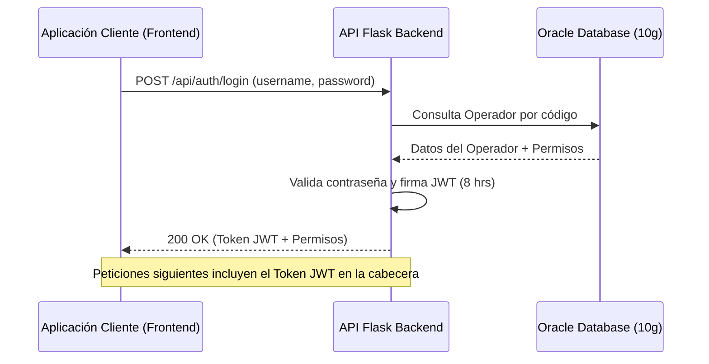

# Guía de Usuario e Integración de la API - SGA Backend

Esta guía está dirigida a usuarios administradores, integradores de sistemas y desarrolladores frontend. Aquí se detalla el funcionamiento de la API expuesta por el backend de **SGA (Sistema de Gestión de Almacenes)** y cómo interactuar con ella.

---

## 1. Introducción al Backend SGA

El backend de SGA es un servicio REST desarrollado en **Flask** que actúa como capa intermedia (API Gateway/Capa de Servicios) entre las interfaces modernas (aplicaciones web, terminales de mano, etc.) y la base de datos centralizada de **Oracle Database**.

Su propósito principal es simplificar y securizar el acceso a la lógica de negocio del SGA, proporcionando endpoints estandarizados mediante formato **JSON** y autenticación basada en tokens web (**JWT**).

---

## 2. Flujo de Autenticación y Sesión

La API implementa un esquema de autenticación sin estado (stateless) mediante **JSON Web Tokens (JWT)**. Para interactuar con los futuros endpoints protegidos de la API, la aplicación cliente primero debe obtener un token válido.



### 2.1. Inicio de Sesión (`POST /api/auth/login`)

Permite a un operador del almacén autenticarse en el sistema utilizando su código de operador y contraseña.

- **URL:** `/api/auth/login`
- **Método HTTP:** `POST`
- **Cabeceras requeridas:** `Content-Type: application/json`

#### Cuerpo de la Petición (Request Body)
```json
{
  "username": "COD_OPERADOR",
  "password": "mi_contraseña_secreta"
}
```

> [!IMPORTANT]
> El campo `username` corresponde al código único del operador (`CODOPERADOR`) registrado en la tabla de operadores del sistema. No es sensible a mayúsculas/minúsculas.

#### Respuesta Exitosa (200 OK)
Cuando las credenciales son válidas, la API responde con un token JWT y un diccionario con los permisos específicos asociados a ese operador:

```json
{
  "status": "success",
  "message": "Autenticación exitosa",
  "token": "eyJhbGciOiJIUzI1NiIsInR5cCI6IkpXVCJ9...",
  "permisos": {
    "PRM_ADMINISTRADOR": false,
    "PRM_ENTRADASMERCANCIA": true,
    "PRM_PREPARACIONPEDIDOS": true,
    "PRM_REUBICACIONES": false,
    "PRM_INVENTARIO": true
  }
}
```

> [!TIP]
> **Caducidad del Token:** El token retornado tiene una validez estricta de **8 horas** a partir del momento de su emisión. Transcurrido este tiempo, el cliente deberá solicitar un nuevo token.

---

## 3. Gestión y Estructura de Permisos

Los permisos de cada operador se gestionan directamente a nivel de base de datos. En la respuesta del login se incluye el diccionario completo de permisos mapeados de forma dinámica.

Cada permiso es una propiedad booleana (`true` o `false`):

| Nombre del Permiso (Clave) | Descripción |
| :--- | :--- |
| **`PRM_ADMINISTRADOR`** | Permite el acceso total a las configuraciones del sistema, gestión de operadores y auditorías globales. |
| **`PRM_ENTRADASMERCANCIA`** | Habilita al usuario para procesar entradas de mercancía, asignación de muelles y control de albaranes de proveedor. |
| **`PRM_PREPARACIONPEDIDOS`** | Autoriza al operador a realizar tareas de picking, preparación de pedidos y montaje/repaso de bultos. |
| **`PRM_REUBICACIONES`** | Permite registrar movimientos de palets entre ubicaciones físicas del almacén y reubicación de artículos. |
| **`PRM_INVENTARIO`** | Habilita al operador a participar en procesos de recuento físico e inventariado del stock del almacén. |

> [!NOTE]
> Las aplicaciones cliente deben utilizar este listado de permisos para mostrar u ocultar componentes visuales y habilitar o deshabilitar opciones en sus menús según los privilegios del operador autenticado.

---

## 4. Cierre de Sesión (`POST /api/auth/logout`)

Debido a que el backend funciona mediante un modelo descentralizado de JWT (sin estado), la invalidación de una sesión se realiza principalmente en la aplicación cliente destruyendo el token guardado. Sin embargo, se proporciona un endpoint estándar para completar la acción de logout.

- **URL:** `/api/auth/logout`
- **Método HTTP:** `POST`

#### Respuesta (200 OK)
```json
{
  "message": "Logout exitoso"
}
```

---

## 5. Códigos de Error Comunes

La API responde utilizando códigos de estado HTTP estándar acompañados de un mensaje aclaratorio en formato JSON:

### 401 Unauthorized (Contraseña Incorrecta)
Se produce cuando el usuario existe en el sistema, pero la contraseña proporcionada no coincide.
```json
{
  "status": "error",
  "error": "Unauthorized",
  "message": "La contraseña proporcionada es incorrecta."
}
```

### 404 Not Found (Operador Inexistente)
Se produce cuando el nombre de usuario/código de operador ingresado no se encuentra en los registros de la base de datos.
```json
{
  "status": "error",
  "error": "Not Found",
  "message": "El operador 'JUAN' no existe en el sistema."
}
```

### 500 Internal Server Error (Fallo del Sistema)
Indica un problema grave en el servidor, como la imposibilidad de conectar con Oracle o un error de base de datos no controlado.
```json
{
  "status": "error",
  "error": "Internal Server Error",
  "message": "Error interno del servidor. Problema con la base de datos o procesamiento."
}
```
