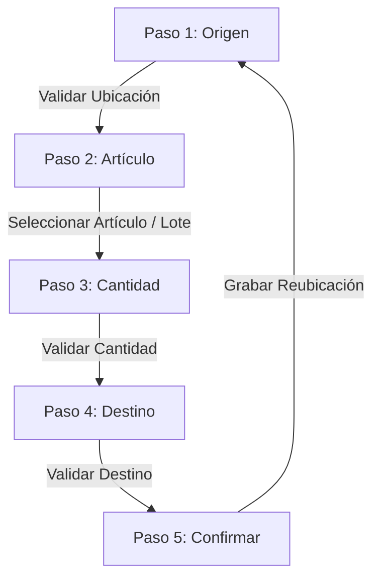
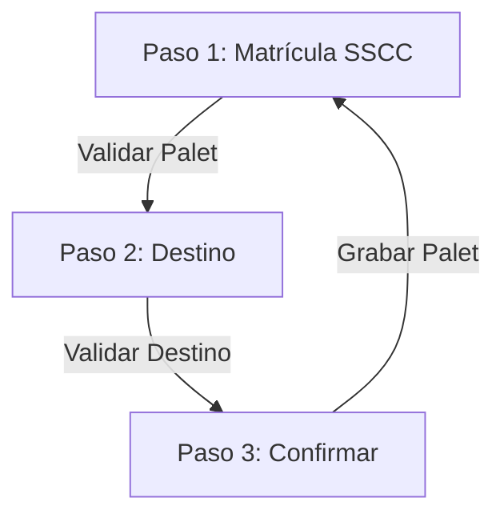

# Módulo de Reubicaciones

Este módulo gestiona el movimiento físico de mercancía en el almacén. Está compuesto por dos flujos principales en el cliente PDA:

1. **Reubicación Libre (Reubicación de Artículo):** Permite mover cantidades específicas de un artículo (y lote si aplica) de una ubicación origen a una ubicación destino.
2. **Reubicación de Entrada (Reubicación de Palet):** Permite mover un palet completo (identificado por su SSCC) desde la zona de entrada (playa) a su ubicación final de destino.

---

## 1. Reubicación Libre

Este flujo se gestiona en el componente [ReubicacionLibre.jsx](file:///g:/Proyectos/SGA_PDA/src/views/ReubicacionLibre.jsx). Sigue una máquina de estados de 5 pasos para guiar al operario:



### Detalle de los Pasos:
*   **Paso 1 (Origen):** El usuario escanea o introduce la etiqueta de la ubicación de origen. Se valida con el endpoint `/api/reubicaciones/validar-ubicacion`. Si la etiqueta corresponde a múltiples posiciones, se muestra un modal para seleccionar la posición correcta.
*   **Paso 2 (Artículo):** Se introduce el código, EAN o descripción del artículo. Si el artículo gestiona trazabilidad (lote) (`PRM_TRAZABILIDAD !== 0`) o fecha de caducidad (`GESTIONARCADUCIDAD !== 0`), se consultan los lotes disponibles en el origen con `/api/reubicaciones/lotes-disponibles`. Si hay múltiples lotes, se muestra un modal de selección para que el operario indique cuál desea mover.
*   **Paso 3 (Cantidad):** Se introduce la cantidad a mover. Se valida con `/api/reubicaciones/validar-cantidad` contra el stock disponible en el origen.
*   **Paso 4 (Destino):** Se escanea o introduce la ubicación de destino. Se valida usando el endpoint `/api/reubicaciones/validar-ubicacion`.
*   **Paso 5 (Confirmar):** Se muestra un resumen y el botón de "Confirmar Reubicación", el cual llama a `/api/reubicaciones/grabar` para ejecutar la transacción en la base de datos a través del procedimiento almacenado `SPREU_REUBICARUBICARTICULO`.

---

## 2. Reubicación de Entrada (Palet)

Este flujo se gestiona en el componente [ReubicacionEntrada.jsx](file:///g:/Proyectos/SGA_PDA/src/views/ReubicacionEntrada.jsx) y está pensado para mover palets completos (matrículas SSCC):



### Detalle de los Pasos:
*   **Paso 1 (Matrícula SSCC):** Se escanea la etiqueta del palet (GS1-128). Se valida y limpia con `/api/reubicaciones/validar-palet` (eliminando posibles prefijos de aplicación como `00` o `]C1`).
*   **Paso 2 (Destino):** Se escanea la ubicación de destino y se valida con `/api/reubicaciones/validar-ubicacion`.
*   **Paso 3 (Confirmar):** Permite grabar el movimiento del palet llamando a `/api/reubicaciones/grabar-palet`, el cual ejecuta el procedimiento almacenado `SPREU_REUBICARPALET`.

---

## 3. Correcciones y Mantenimiento

### Resolución de Congelamiento de Pantalla al Validar Destino
Durante las pruebas de reubicación de artículos y palets (por ejemplo, al mover de origen `ME1` a destino `U00000001`), se identificó que la pantalla del dispositivo se quedaba con el indicador de carga (spinner) indefinidamente y el botón de confirmación deshabilitado.

**Causa:**
En ambos componentes, el método `handleDestinoKeyDown` activaba el estado de carga (`setLoading(true)`), pero solo llamaba a `setLoading(false)` en los bloques de error o excepción. Al retornar una validación exitosa (`res.status === 'success'`), la transición de paso se completaba en el estado (`setStep`), pero el indicador de carga seguía activo, bloqueando la interacción.

**Solución:**
Se estructuraron las llamadas asíncronas de validación de destino dentro de bloques `try-catch-finally`, asegurando que `setLoading(false)` se ejecute de manera garantizada al finalizar la petición:

```javascript
try {
  const res = await validarUbicacion(destinoInput);
  if (res.status === 'success') {
    setDestinoData(res.ubicacion);
    setStep(5); // o Step 3 en Entrada
  } else if (res.status === 'necesita_posicion') {
    setPosicionesDisponibles(res.opciones);
    setShowPosicionModal(true);
  } else {
    setError(res.message || 'Ubicación destino no encontrada');
  }
} catch (err) {
  setError(err.response?.data?.message || 'Error al validar ubicación destino.');
} finally {
  setLoading(false); // <--- Garantiza que la interfaz se descongele
}
```

### Control de Lote y Caducidad según la configuración del Artículo
**Problema:**
Anteriormente, la reubicación libre solo controlaba o solicitaba la información del lote si **tanto el artículo como la ubicación de origen** tenían activado el parámetro de trazabilidad (`PRM_TRAZABILIDAD !== 0`). Esto impedía que se seleccionara y se registrara el lote/fecha de caducidad si el artículo gestionaba caducidad pero la ubicación no estaba configurada estrictamente con trazabilidad de origen.

**Solución:**
Se modificó la comprobación en el cliente PDA para que evalúe si el artículo requiere control de lote (`PRM_TRAZABILIDAD !== 0`) o control de fecha de caducidad (`GESTIONARCADUCIDAD !== 0`), abstrayéndose de la configuración de la ubicación. Esto asegura que siempre que el artículo tenga trazabilidad o caducidad, se obligue a seleccionar el lote/fecha de origen y se transmitan estos datos a la grabación final en base de datos.

```javascript
// Evalúa si el artículo gestiona lote o fecha de caducidad
const gestionaLote = (article.PRM_TRAZABILIDAD !== 0) || (article.GESTIONARCADUCIDAD !== 0);
```
